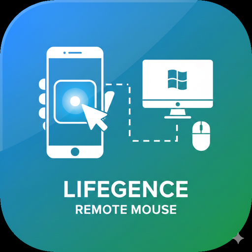

# Remote Mouse

[](https://github.com/lifegence/lifegence-remote-mouse/actions/workflows/build.yml)
[](https://opensource.org/licenses/MIT)
[]()

Use your smartphone as a PC mouse/touchpad.

Perfect for when your trackpad is broken or for remote presentations.

<p align="center">
  
</p>

## Features

- **Easy Connection**: Instant connection via QR code scan
- **Low Latency**: Smooth operation with WebSocket over WiFi
- **Full Functionality**: Mouse movement, clicks, and scrolling
- **Keyboard-Free Setup**: Launch PC server with just Enter key

## Controls

| Action | Function |
|--------|----------|
| Drag | Mouse movement |
| Tap | Left click |
| Long press (0.5s) | Right click |
| Two-finger swipe | Scroll |

## Quick Start

### 1. Download

Download the latest version from [Releases](https://github.com/lifegence/lifegence-remote-mouse/releases):

- **Windows**: `RemoteMouseServer_Setup.exe` or `RemoteMouseServer.exe`
- **Android**: `remote-mouse.apk`

### 2. Start Server on PC

```
Run RemoteMouseServer.exe
→ QR code and IP address will be displayed
```

### 3. Connect from Phone

```
Open the app
→ Scan QR code or enter IP address
→ Tap Connect
```

### 4. Use It

Use your phone as a touchpad!

## Project Structure

```
lifegence-remote-mouse/
├── server/                 # PC Server (Python/Windows)
│   ├── main.py            # Main app (GUI)
│   ├── websocket_server.py # WebSocket communication
│   ├── mouse_controller.py # Mouse control
│   ├── requirements.txt
│   ├── build.bat          # Build script
│   └── installer.iss      # Installer config
│
├── app/                    # Android App (Flutter)
│   ├── lib/
│   │   ├── main.dart
│   │   ├── screens/       # Screens
│   │   ├── services/      # WebSocket communication
│   │   └── widgets/       # Touchpad
│   └── pubspec.yaml
│
├── docs/                   # Documentation
│   ├── SETUP_SERVER.md
│   ├── SETUP_APP.md
│   └── CONTRIBUTING.md
│
└── .github/workflows/      # CI/CD
    └── build.yml
```

## Development

### Server (Python)

```bash
cd server
pip install -r requirements.txt
python main.py
```

### App (Flutter)

```bash
cd app
flutter pub get
flutter run
```

See [CONTRIBUTING.md](docs/CONTRIBUTING.md) for details.

## Build

### Windows Installer

```bash
cd server
build.bat
```

If [Inno Setup](https://jrsoftware.org/isdl.php) is installed, the installer will be generated automatically.

### Android APK

```bash
cd app
flutter build apk --release
```

## System Requirements

| Component | Requirements |
|-----------|-------------|
| Server | Windows 10/11, Python 3.8+ |
| App | Android 5.0 (API 21) or higher |
| Network | Same WiFi network |

## Troubleshooting

### Cannot Connect

1. Ensure PC and phone are on the **same WiFi** network
2. Allow port **8765** in Windows Firewall
3. Disable VPN temporarily if using one

### Slow Response

- Use 5GHz WiFi (faster than 2.4GHz)
- Stay close to the router

## License

[MIT License](LICENSE)

## Contributing

Issues and Pull Requests are welcome.
See [CONTRIBUTING.md](docs/CONTRIBUTING.md) for details.
